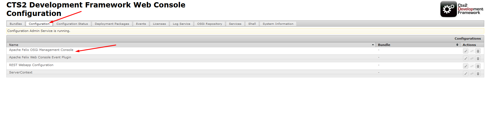
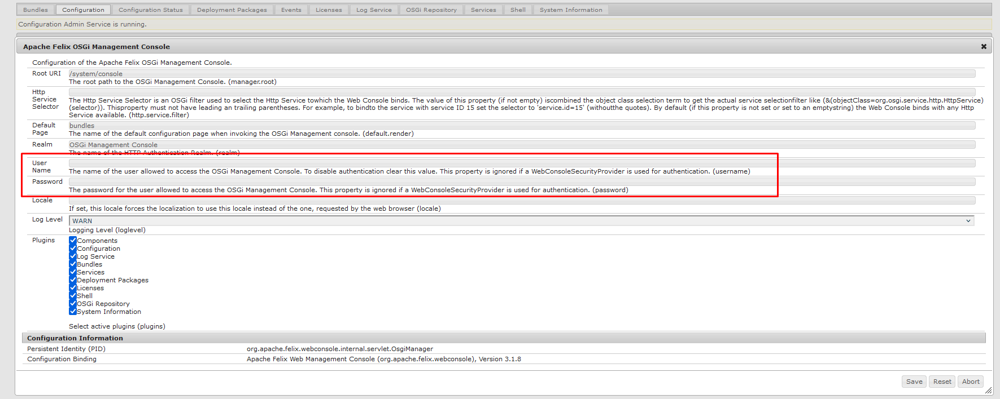

# Servizio Terminologico Integrato (CTS2 Framework) 

### Nome del modulo: sti-cts2-framework


## Modulo maven contenente i sorgenti del framework CTS2


### Descrizione

CTS2 Framework è l'implementazione effettuata dalla Mayo Clinic (USA) dello standard di interoperabilità semantica di HL7 Common Terminology Services 2, la cui versione 1.2 è stata pubblicata nell’aprile 2015. Tale standard offre delle specifiche funzionali per la realizzazione di servizi per la gestione integrata di terminologie mediche. Il CTS2 Framework che viene riutilizzato, descritto di seguito, implementa le specifiche tecniche PSM (Platform Specific Model) di CTS2. Si rimanda  a seguente link per il repository del progetto originale con tutti i riferimenti: https://github.com/cts2/cts2-framework


### Descrizione Repository

Il repository contiene un progetto maven con tutti i moduli relativi ai sorgenti del framework


## Prerequisiti

Prima di procedere al download dei sorgenti, per il corretto funzionamento, occorre installare i seguenti applicativi. Per la loro installazione si demanda alla documentazione ufficiale

- SO AlmaLinuxOS [https://almalinux.org/it/]
- JDK 1.8 [https://www.oracle.com/it/java/technologies/javase/javase8-archive-downloads.html]
- Maven 3.6.3 [https://maven.apache.org/docs/3.6.3/release-notes.html] 
- liferay-portal-6.2-ce-ga6 [https://sourceforge.net/projects/lportal/files/Liferay%20Portal/6.2.5%20GA6/]


## Installazione 

Per procedere alla corretta installazione dei moduli del presente repository è necessario prima scaricare, configurare e distribuire (effettuare il deployment) di Liferay Portal (versione 6.2-ce-ga6 i riferimenti sono nella sezione prerequisiti).
Per l'installazione degli applicativi [AlmaLinuxOS, JDK 1.8, liferay-portal-6.2-ce-ga6] si rimanda alla documentazione ufficiale.


## Build

Per la build del modulo è necessario scaricare e installare - Maven 3.6.3 o superiore

A questo punto si considera un ambiente configurato e con Liferay correttamente avviato. 
Per la build i comandi da lanciare sono i seguenti  

```sh
git clone https://github.com/iit-rende/sti-cts2-framework.git
cd sti-cts2-framework
mvn clean install
```


## Deploy

Una volta effettuata la build del modulo bisognerà effettuare il deployment della webapp generata sotto il Tomcat di Liferay (...liferay/tomcat/webapp) e se tutto è stato eseguito correttamente la console web del CTS2 framework sarà disponibile all'indirizzo http://HOST/cts2framework/ 
Per accedere alla console, l'account di default è [admin/admin].


Di seguito le istruzioni per modificare la password:

- dopo aver effettuato l'accesso alla console entrare nel tab "Configuration"
- selezionare "Apache Felix OSGi Management Console"
- dalla finestra che viene mostrata impostare la nuova username e la password e salvare 







## Copyright ©

 [TODO]

## Maintainer

 [TODO]


## License 

 [TODO]
**http://www.apache.org/licenses/LICENSE-2.0**


